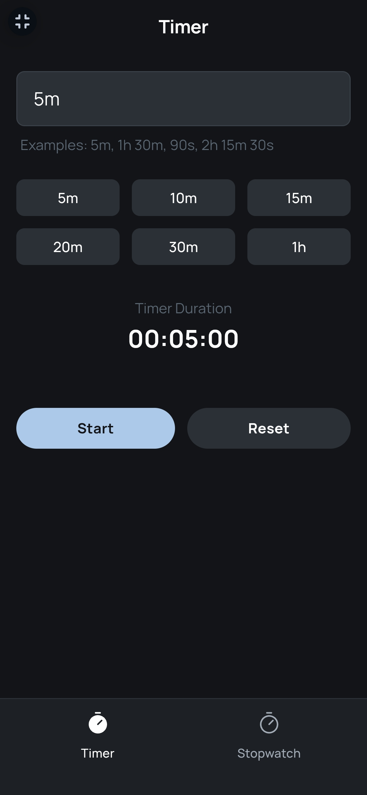
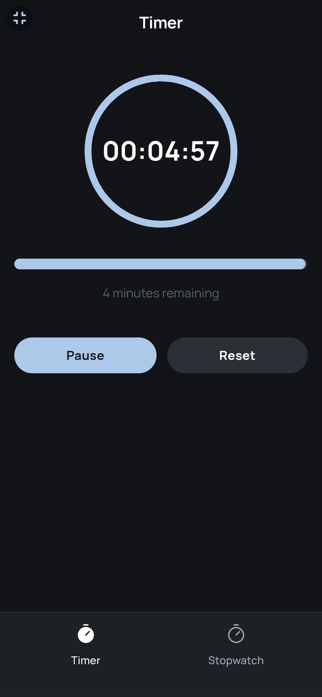
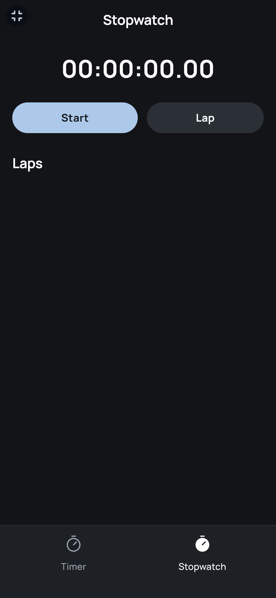

# Clock App ⏰

A modern, responsive web application featuring a Clock, Timer, and Stopwatch with beautiful visual countdown animations and a sleek dark-themed interface.

## ✨ Features

### Clock
- **Analog Display**: Real-time analog clock with hour, minute, and second hands.
- **Digital Display**: Shows time in 12-hour format (e.g., `03:40:23 PM`) below the analog clock.
- **Hour Markers**: Clear markers at 12, 3, 6, and 9 for easy reading.
- **Default Tab**: Loads as the first tab on app startup.

### Timer
- **Flexible Time Input**: Enter time in natural language (e.g., `5m`, `1h 30m`, `90s`).
- **Quick Presets**: Buttons for common durations (5m, 10m, 15m, 20m, 30m, 1h).
- **Visual Countdown**: Circular progress ring (desktop) and linear progress bar (mobile) to show remaining time.
- **No Time Limits**: Set any duration you want.
- **Live Preview**: See parsed time duration as you type in the input field.
- **Notifications**: Browser notifications and audio (four beeps) when the timer completes.

### Stopwatch
- **Precise Timing**: Accurate to centiseconds (e.g., `00:00:00.00`).
- **Lap Functionality**: Record multiple lap times with individual durations.
- **Clean Interface**: Easy-to-read time display.
- **Lap History**: View all recorded laps below the stopwatch.

### General
- **Responsive Design**: Works seamlessly on desktop, tablet, and mobile devices.
- **Dark Theme**: Easy on the eyes with a consistent color scheme.
- **Fixed Navigation**: Bottom tabs (Clock, Timer, Stopwatch) stay accessible while scrolling.
- **Modern UI**: Clean, professional design with smooth animations.

## 🚀 Demo

[Live Demo](https://derrickappah.github.io/Clock/)   

## 📱 Screenshots


   ### Clock
   

   ### Timer
   
   

   ### Stopwatch
   
   ```

## 🛠️ Technologies Used

- **HTML5**: Semantic markup structure (in `index.html`).
- **CSS3**: Custom styles and animations (in `styles.css`).
- **JavaScript (ES6+)**: Interactive functionality (in `script.js`).
- **Tailwind CSS**: Utility-first CSS framework (via CDN).
- **SVG**: Circular progress indicators for the timer.
- **Google Fonts**: Manrope and Noto Sans for modern typography.
- **Web Audio API**: Audio notifications for timer completion.

## 📦 Installation

1. Clone the repository:
   ```bash
   git clone https://derrickappah.github.io/Clock/
   ```

2. Navigate to the project directory:
   ```bash
   cd clock-app
   ```

3. Ensure the file structure is correct (see below), then open `index.html` in a web browser or serve it using a local server:
   ```bash
   # Using Python 3
   python -m http.server 8000
   
   # Using Node.js (if you have live-server installed)
   npx live-server
   ```

4. Visit `http://localhost:8000` in your browser.

## 🎯 Usage

### Clock
1. The Clock tab loads by default, showing an analog clock with hour, minute, and second hands.
2. The digital time below displays in 12-hour format (e.g., `03:40:23 PM`).
3. Updates automatically every second based on the system time.

### Timer
1. Switch to the Timer tab using the bottom navigation.
2. Enter a duration in the input field (e.g., `25m`, `1h 30m`, `90s`) or click a preset button (5m, 10m, 15m, etc.).
3. Click **Start** to begin the countdown.
4. Watch the visual progress ring (or bar on mobile) decrease as time counts down.
5. Use **Pause**/**Resume** to control the timer.
6. Click **Reset** to return to the input screen.
7. A sound (four beeps) and browser notification alert when the timer completes.

### Stopwatch
1. Switch to the Stopwatch tab using the bottom navigation.
2. Press **Start** to begin timing.
3. Press **Lap** to record lap times while running.
4. Press **Stop** to pause, then **Reset** to clear the time and laps.

## 🔧 File Structure

```
clock-app/
├── index.html      # Main HTML structure
├── styles.css      # Custom CSS styles
├── script.js       # JavaScript functionality
└── README.md       # Project documentation
```

## 🤝 Contributing

1. Fork the project.
2. Create your feature branch (`git checkout -b feature/AmazingFeature`).
3. Commit your changes (`git commit -m 'Add some AmazingFeature'`).
4. Push to the branch (`git push origin feature/AmazingFeature`).
5. Open a Pull Request.

## 📝 License

This project is licensed under the MIT License - see the [LICENSE](LICENSE) file for details.

## 🙏 Acknowledgments

- Icons from [Phosphor Icons](https://phosphoricons.com/) (used for navigation tabs).
- Fonts from [Google Fonts](https://fonts.google.com/) (Manrope and Noto Sans).
- Styling with [Tailwind CSS](https://tailwindcss.com/) (via CDN).
```
